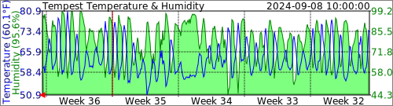
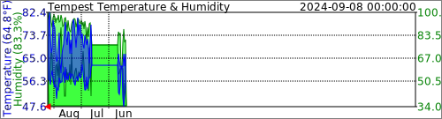
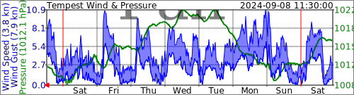
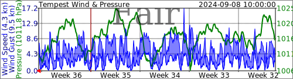

# Weatherflow Tempest SVG Logger

Create Local SVG graphs from UDP broadcasts of the Weatherflow Tempest Weather Station

## Example Output

## Weatherflow Data

### UDP Basics
The WeatherFlow Smart Weather Station's hub broadcasts UDP messages over port 50222 on the local network.

Observation (Tempest) [type = obs_st]
	
    {
        "serial_number": "ST-00000512",
        "type": "obs_st",
        "hub_sn": "HB-00013030",
        "obs": [
            [1588948614,0.18,0.22,0.27,144,6,1017.57,22.37,50.26,328,0.03,3,0.000000,0,0,0,2.410,1]
        ],
        "firmware_revision": 129
    }

| Index | Field                                   | Units                                                        |
| ----- | --------------------------------------- | ------------------------------------------------------------ |
| 0     | Time Epoch                              | Seconds                                                      |
| 1     | Wind Lull (minimum 3 second sample)     | m/s                                                          |
| 2     | Wind Avg (average over report interval) | m/s                                                          |
| 3     | Wind Gust (maximum 3 second sample)     | m/s                                                          |
| 4     | Wind Direction                          | Degrees                                                      |
| 5     | Wind Sample Interval                    | seconds                                                      |
| 6     | Station Pressure                        | MB                                                           |
| 7     | Air Temperature                         | C                                                            |
| 8     | Relative Humidity                       | %                                                            |
| 9     | Illuminance                             | Lux                                                          |
| 10    | UV                                      | Index                                                        |
| 11    | Solar Radiation                         | W/m^2                                                        |
| 12    | Rain amount over previous minute        | mm                                                           |
| 13    | Precipitation Type                      | 0 = none, 1 = rain, 2 = hail, 3 = rain + hail (experimental) |
| 14    | Lightning Strike Avg Distance           | km                                                           |
| 15    | Lightning Strike Count                  |                                                              |
| 16    | Battery                                 | Volts                                                        |
| 17    | Report Interval                         | Minutes                                                      |

Rapid Wind [type = rapid_wind]
	
	{
	  "serial_number": "SK-00008453",
	  "type":"rapid_wind",
	  "hub_sn": "HB-00000001",
	  "ob":[1493322445,2.3,128]
	}

| Index | Field          | Units   |
| ----- | -------------- | ------- |
| 0     | Time Epoch     | Seconds |
| 1     | Wind Speed     | mps     |
| 2     | Wind Direction | Degrees |

